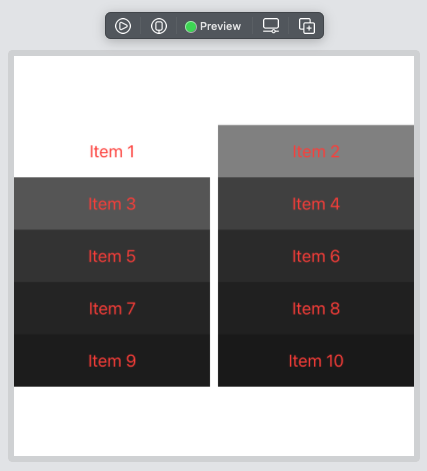
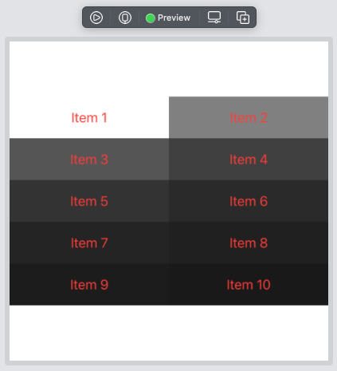

# SwiftUI LazyVGrid Spacing

I was having the issue that there is a vertical space in the `LazyVGrid` in SwiftUI. It turns out there's a extra parameter I was missing in `GridItem`'s initialiser for spacing. So using `GridItem(.flexible(), spacing: 0)` removes the vertical spacing between the columns as shown below.

